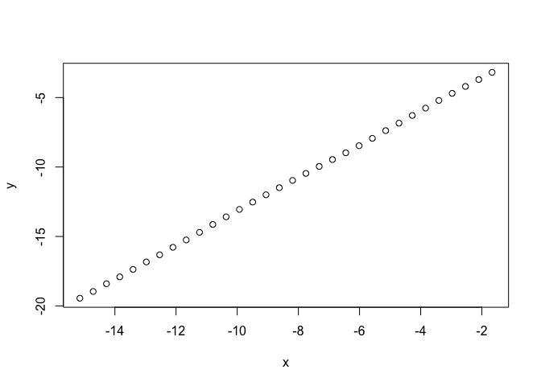
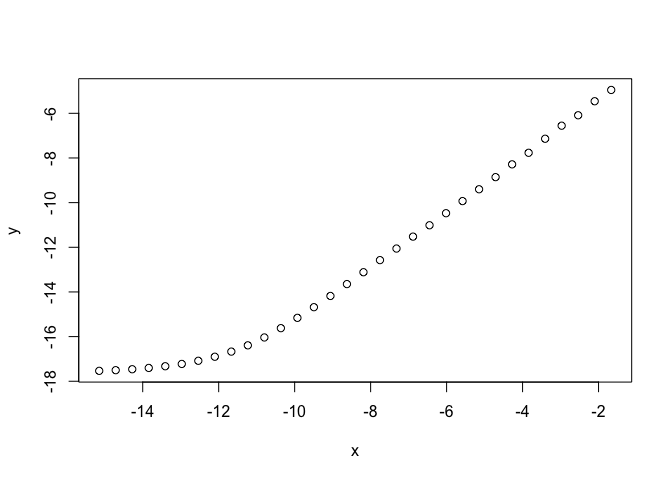

<!-- README.md is generated from README.Rmd. Please edit that file -->
Overview
--------

The atriar package contains two sets of functions for computing fractal or intrinsic dimensions of data sets.

*Nearest neighbor* based methods allow the estimation of the [correlation sum](https://en.wikipedia.org/wiki/Correlation_integral). and related properties. The correlation dimension is one of the intrinsic dimensions of a data set and can be viewed as a measure of its complexity. It is expected that the performance of many machine learning algorithms depends on the intrinsic dimension of the input data.

This package contains an implementation of the [ATRIA nearest neighbor algorithm](https://www.researchgate.net/publication/12238515_Fast_nearest-neighbor_searching_for_nonlinear_signal_processing). which is a variant of the ball-tree algorithm family. It supports both exact and approximate k-nearest neighbor and range searches. During preprocessing, a search tree is constructed by dividing the set of points in two (sub)clusters. Each cluster is than subdivided until a minimum number of points is reached When performing a query, the triangle inequality is used to exclude cluster from further searching. ATRIA might be a good choice for unevenly distributed points in very high dimensional spaces.

*Boxcounting* methods bin the points of a data set into a D-dimensional grid and compute various statistics based on the distribution of points into grid boxes. Counting the number of non-empty boxes at different grid resolutions allow the estimation of the capacity dimension of the data set. The underlying workhorse for the boxcounting methods is a [ternary search tree](https://en.wikipedia.org/wiki/Ternary_search_tree) implemented in C++ which is both time and space efficient.

Part of the code was released before within the OpenTSTOOL Matlab toolbox by the DPI Goettingen, Germany.

Installation
------------

The package is not (yet) on CRAN. You can also use the development version from GitHub:

``` r
# install.packages("devtools")
devtools::install_github("christianmerkwirth/atriar")
```

The package is tested to build successfully on OS X and on Linux.

Nearest Neighbors Searching
---------------------------

Fast nearest neighbor searching usually starts from preprocessing a data set of points into an index structure (e.g. ball tree, random projections) that is then used to accelerate subsequent neighbor queries:

``` r
# Create a set of points in 4-d.
D <- 4
points <- matrix(runif(1e6), ncol=D)
# Creating the ATRIA nearest neighbor searcher object.
searcher = create_searcher(points, metric="euclidian")
```

Function create\_searcher does the preprocessing for a given set of points. The returned searcher object contains preprocessing information that is a mandatory input argument for k-NN and range queries. Preprocessing and querying is divided into separate functions to give the user the possibility to re-use the searcher object when doing multiple searches on the same point set. Note that as soon as the underlying point set is changed or modified, one has to recompute the searcher for the updated set of points.

``` r
# Deleting the searcher object, freeing the allocated memory.
release_searcher(searcher)
```

### k-Nearest Neighbor Queries

``` r
library(atriar)

# Create a set of points in 4-d.
D <- 4
points <- matrix(runif(1e6), ncol=D)
# Creating the ATRIA nearest neighbor searcher object.
searcher = create_searcher(points, metric="euclidian")
```

    ## Using euclidian metric.
    ## ATRIA Constructor
    ## Size of point set : 250000  points of dimension 4
    ## Number of points used : 250000
    ## MINPOINTS : 64
    ## Root center : 42592
    ## Root starting index  : 1
    ## Root length : 249999
    ## Root Rmax : 1.51764
    ## Created tree structure for ATRIA searcher
    ## Approx. dataset radius: 1.51764

``` r
k.max <- 8
rand.sample <- sample.int(nrow(points), size = 1000)
nn <- search_k_neighbors(
    searcher = searcher,
    k = k.max,
    query_points = points[rand.sample, ],
    exclude = cbind(rand.sample, rand.sample)
  )
  
str(nn)
```

    ## List of 2
    ##  $ index: int [1:1000, 1:8] 97552 109147 109538 230959 242810 110531 227740 79973 179699 160963 ...
    ##  $ dist : num [1:1000, 1:8] 0.0356 0.0285 0.0146 0.0301 0.0251 ...

``` r
# Cleanup, delete the searcher object.
release_searcher(searcher)
```

    ## ATRIA Destructor
    ## Total_clusters : 11559
    ## Total number of points in terminal nodes : 238441
    ## Average number of points in a terminal node : 41.2528
    ## Average percentage of points searched 0.437813% (1095)
    ## Average number of terminal nodes visited : 33.782

    ## [1] TRUE

The output list returned by search\_k\_neighbors contains fields *index* and *dist* which both are matrices with as many rows as there were query points. Indices are 1-based and can be used to index R matrices without rebasing.

In general, reference points query.points can be arbitrarily located, but it is also possible that query.points are taken from the preprocessed points set. To allow the user to avoid self-matches, search\_k\_neighbors accepts the optional input argument *exclude* which is a nrow(query.points) by 2 integer matrix. *exclude* specifies a range of indices (i.e. first, last) that is not eligible as nearest neighbors for the given query point.

### Approximate k-Nearest Neighbor Queries

Approximate nearest neighbors algorithms report neighbors to the query point q with distances possibly greater than the true nearest neighbors distances. The maximal allowed relative error, named *epsilon*, is given as a parameter to the algorithm. For epsilon =0, the approximate search returns the true (exact) nearest neighbor(s). Computing exact nearest neighbors for data set with intrinsic dimension much higher than 6 seems to be a very time-consuming task. Few algorithms seem to perform significantly better than a brute-force computation of all distances. However, it has been shown that by computing nearest neighbors approximately, it is possible to achieve significantly faster execution times with relatively small actual errors in the reported distances. See (<https://github.com/erikbern/ann-benchmarks>) for a more thorough comparison of k-NN implementations.

``` r
# Create a set of points in 12-d.
D <- 12
points <- matrix(runif(1.2e6), ncol=D)
# Creating the ATRIA nearest neighbor searcher object.
searcher = create_searcher(points, metric="euclidian")
```

    ## Using euclidian metric.
    ## ATRIA Constructor
    ## Size of point set : 100000  points of dimension 12
    ## Number of points used : 100000
    ## MINPOINTS : 64
    ## Root center : 17036
    ## Root starting index  : 1
    ## Root length : 99999
    ## Root Rmax : 2.21967
    ## Created tree structure for ATRIA searcher
    ## Approx. dataset radius: 2.21967

``` r
k.max <- 8
rand.sample <- sample.int(nrow(points), size = 1000)

library(microbenchmark)
microbenchmark(
  search_k_neighbors(searcher, k.max, points[rand.sample, ]),
  search_k_neighbors(searcher, k.max, points[rand.sample, ], epsilon=3.0),
  times=10)
```

    ## Unit: milliseconds
    ##                                                                     expr
    ##               search_k_neighbors(searcher, k.max, points[rand.sample, ])
    ##  search_k_neighbors(searcher, k.max, points[rand.sample, ], epsilon = 3)
    ##      min      lq    mean  median      uq     max neval
    ##  2311.45 2334.50 2371.54 2348.98 2382.29 2540.93    10
    ##   742.78  747.23  778.14  767.19  801.22  845.23    10

``` r
# Cleanup, delete the searcher object.
release_searcher(searcher)
```

    ## ATRIA Destructor
    ## Total_clusters : 4581
    ## Total number of points in terminal nodes : 95419
    ## Average number of points in a terminal node : 41.6495
    ## Average percentage of points searched 29.64% (29641)
    ## Average number of terminal nodes visited : 1088.23

    ## [1] TRUE

### Range queries

In the task of range searching , we ask for all points of data set P that have distance r or less from the query point q. Sometimes range searching is called a fixed size approach, while k nearest neighbors searching is called a fixed mass approach.

``` r
# Create a set of points in 4-d.
D <- 4
points <- matrix(runif(1e6), ncol=D)
# Creating the ATRIA nearest neighbor searcher object.
searcher = create_searcher(points, metric="euclidian")
```

    ## Using euclidian metric.
    ## ATRIA Constructor
    ## Size of point set : 250000  points of dimension 4
    ## Number of points used : 250000
    ## MINPOINTS : 64
    ## Root center : 42592
    ## Root starting index  : 1
    ## Root length : 249999
    ## Root Rmax : 1.58156
    ## Created tree structure for ATRIA searcher
    ## Approx. dataset radius: 1.58156

``` r
radius <- 0.2
rand.sample <- sample.int(nrow(points), size = 4)
nn <- search_range(
  searcher = searcher,
  radius = radius,
  query_points = points[rand.sample, ],
  # Ignore samples with index smaller than the query point
  # so we avoid counting the same pairwise distance twice.
  exclude = cbind(rep(-1, 4), rand.sample)
)
  
str(nn)
```

    ## List of 2
    ##  $ count: int [1:4] 134 437 387 347
    ##  $ nn   :List of 4
    ##   ..$ :List of 2
    ##   .. ..$ index: int [1:134] 236898 232130 238932 246095 230962 242479 232658 225686 225644 242697 ...
    ##   .. ..$ dist : num [1:134] 0.188 0.198 0.173 0.167 0.173 ...
    ##   ..$ :List of 2
    ##   .. ..$ index: int [1:437] 214341 207721 227004 249868 200325 236372 237558 190688 210730 187877 ...
    ##   .. ..$ dist : num [1:437] 0.199 0.182 0.128 0.199 0.159 ...
    ##   ..$ :List of 2
    ##   .. ..$ index: int [1:387] 199201 221313 226957 209138 239375 191391 222383 225560 233876 194497 ...
    ##   .. ..$ dist : num [1:387] 0.125 0.192 0.18 0.156 0.191 ...
    ##   ..$ :List of 2
    ##   .. ..$ index: int [1:347] 209526 227165 167905 169054 197353 193238 190632 200059 220091 199520 ...
    ##   .. ..$ dist : num [1:347] 0.1488 0.148 0.1764 0.0697 0.1875 ...

``` r
# Cleanup, delete the searcher object.
release_searcher(searcher)
```

    ## ATRIA Destructor
    ## Total_clusters : 11505
    ## Total number of points in terminal nodes : 238495
    ## Average number of points in a terminal node : 41.4558
    ## Average percentage of points searched 0.989% (2473)
    ## Average number of terminal nodes visited : 189.25

    ## [1] TRUE

The index and distance vectors for a single query point have the length that is given in count. Both vectors are not sorted by distance.

Boxcounting
-----------

Fast box counting for a data set of points X (row vectors of integers of dimension D). We assume that each row of the input data set addresses single box in a D-dimensional space. By means of a fast ternary search tree algorithm, we count the number of times each box has been visited in all subspaces from 1, 2, 3, ... up to D dimensions. A subpsace of dimension 2 e.g. is constructed from the two leftmost rows of the input matrix X. The algorithm returns the boxcounting, information and correlation measures for all prefix-subspaces 1, ..., D.

``` r
# Create a million data points in 10-d.
D <- 10
X <- floor(10 * matrix(runif(1e6), ncol=D))
mode(X) <- "integer"

# Let's just count non-empty bins in a D-dimensional space.
y.unique <- unique(X);
bc <- boxcount(X)

boxes.count <- bc$boxes[D]
unique.count <- nrow(y.unique)

round(boxes.count) == unique.count
```

    ## [1] TRUE

``` r
library(microbenchmark)
microbenchmark(boxcount(X), unique(X), times=10)
```

    ## Unit: milliseconds
    ##         expr     min      lq    mean  median      uq     max neval
    ##  boxcount(X)  47.025  47.695  49.537  48.582  50.772  54.072    10
    ##    unique(X) 579.433 626.349 654.070 661.681 690.049 698.483    10

Dimension Estimation
--------------------

Below a typical workflow for estimating the correlation dimension by analying the slope of the correlation sum versus the distance in log scale:

``` r
# Create a downsampled data set of the terated Henon map.
data <- henon(2e6, params = c(-1.4, 0.3, 0.1 * runif(2)))
data <- data[sample.int(n = nrow(data), size = 2e5), ]

# Here we create the ATRIA nearest neighbor searcher object.
searcher = create_searcher(data, metric="euclidian", cluster_max_points = 64)
```

    ## Using euclidian metric.
    ## ATRIA Constructor
    ## Size of point set : 200000  points of dimension 2
    ## Number of points used : 200000
    ## MINPOINTS : 64
    ## Root center : 34073
    ## Root starting index  : 1
    ## Root length : 199999
    ## Root Rmax : 2.38161
    ## Created tree structure for ATRIA searcher
    ## Approx. dataset radius: 2.38161

``` r
# We need to get an idea about typical small and large distances
# in the data set in order to generate distance bins.
dist.limits <- distlimits(searcher, data)
dist.breaks <- logspace(dist.limits[1], dist.limits[2], 32)

# Invoke the correlation sum computation.
res <- corrsum(searcher=searcher,
               data=data,
               dist.breaks = dist.breaks,
               min.actual.pairs = 2000,
               min.nr.samples.at.scale = 256,
               max.nr.samples.at.scale = 1024,
               batch.size = 128)

# Print and visualize results.
print(res)
```

    ## $dists
    ##  [1] 0.0000e+00 2.7590e-05 3.7294e-05 5.0411e-05 6.8142e-05 9.2108e-05
    ##  [7] 1.2450e-04 1.6829e-04 2.2749e-04 3.0750e-04 4.1565e-04 5.6184e-04
    ## [13] 7.5945e-04 1.0266e-03 1.3876e-03 1.8757e-03 2.5354e-03 3.4271e-03
    ## [19] 4.6325e-03 6.2618e-03 8.4642e-03 1.1441e-02 1.5465e-02 2.0905e-02
    ## [25] 2.8257e-02 3.8196e-02 5.1630e-02 6.9789e-02 9.4335e-02 1.2751e-01
    ## [31] 1.7236e-01 2.3299e-01 3.1493e-01
    ## 
    ## $correlation.sum
    ##  [1] 0.0000e+00 1.3990e-06 1.9598e-06 2.8793e-06 4.0585e-06 5.8979e-06
    ##  [7] 8.5468e-06 1.2219e-05 1.7748e-05 2.5607e-05 3.7483e-05 5.5491e-05
    ## [13] 8.1149e-05 1.1763e-04 1.6978e-04 2.4380e-04 3.4798e-04 4.9927e-04
    ## [19] 7.0961e-04 1.0062e-03 1.4178e-03 1.9870e-03 2.8252e-03 4.0842e-03
    ## [25] 5.9958e-03 8.6965e-03 1.2791e-02 1.8430e-02 2.7047e-02 3.8581e-02
    ## [31] 5.4418e-02 7.6832e-02 1.0998e-01
    ## 
    ## $actual.pairs.count
    ##  [1]       0    1804     666     996    1155    1612    2046    2461
    ##  [9]    3563    4869    7056   10224   13866   18767   25434   34301
    ## [17]   45615   62491   81122  106426  137211  176059  237229  326003
    ## [25]  446519  559180  739423  875357 1119522 1182548 1226091 1192388
    ## [33]  890920
    ## 
    ## $potential.pairs.count
    ##  [1] 1289454025 1289454025 1187735802 1083121816  979496492  876378793
    ##  [7]  772387404  670203120  644393387  619525267  594131195  567767629
    ## [13]  540406562  514437686  487752870  463371472  437833797  413075706
    ## [19]  385666468  358877355  333297663  309335836  283021191  258930857
    ## [25]  233590081  207048454  180568908  155255221  129909094  102526360
    ## [31]   77421603   53199253   26880424
    ## 
    ## $samples.used
    ##  [1]    0 1024 1024 1024 1024 1024 1024  256  256  256  256  256  256  256
    ## [15]  256  256  256  256  256  256  256  256  256  256  256  256  256  256
    ## [29]  256  256  256  256  256

``` r
x <- log2(res$dists)
y <-log2(res$correlation.sum)
plot(x, y)
```



``` r
# Fit a linear model to the data in log-log scale. The slope should give
# us an estimate of the correlation dimension.
print(lm(y ~ x, data = data.frame(x = x, y = y)[2:18,]))
```

    ## 
    ## Call:
    ## lm(formula = y ~ x, data = data.frame(x = x, y = y)[2:18, ])
    ## 
    ## Coefficients:
    ## (Intercept)            x  
    ##      -0.886        1.229

``` r
# Cleanup, delete the searcher object.
release_searcher(searcher)
```

    ## ATRIA Destructor
    ## Total_clusters : 9245
    ## Total number of points in terminal nodes : 190755
    ## Average number of points in a terminal node : 41.2622
    ## Average percentage of points searched 0.466638% (934)
    ## Average number of terminal nodes visited : 38.019

    ## [1] TRUE

We also can use boxcouting to get a rough estimate of the capacity dimension:

``` r
# Next let's use the boxcounting approach to estimate the capacity dimension.
res <- boxcounting(data, dist.breaks)

x <- log2(res$dists)
y <- -log2(res$boxes[, 2])

plot(x, y)
```



``` r
print(lm(y ~ x, data = data.frame(x = x, y = y)[10:24,]))
```

    ## 
    ## Call:
    ## lm(formula = y ~ x, data = data.frame(x = x, y = y)[10:24, ])
    ## 
    ## Coefficients:
    ## (Intercept)            x  
    ##       -3.46         1.17

Author
------

Christian Merkwirth

License
-------

GPL (&gt;= 2)

References
----------

[Nearest-neighbor based methods for nonlinear time-series analysis, Christian Merkwirth, 2001](http://hdl.handle.net/11858/00-1735-0000-0006-B40F-A)
